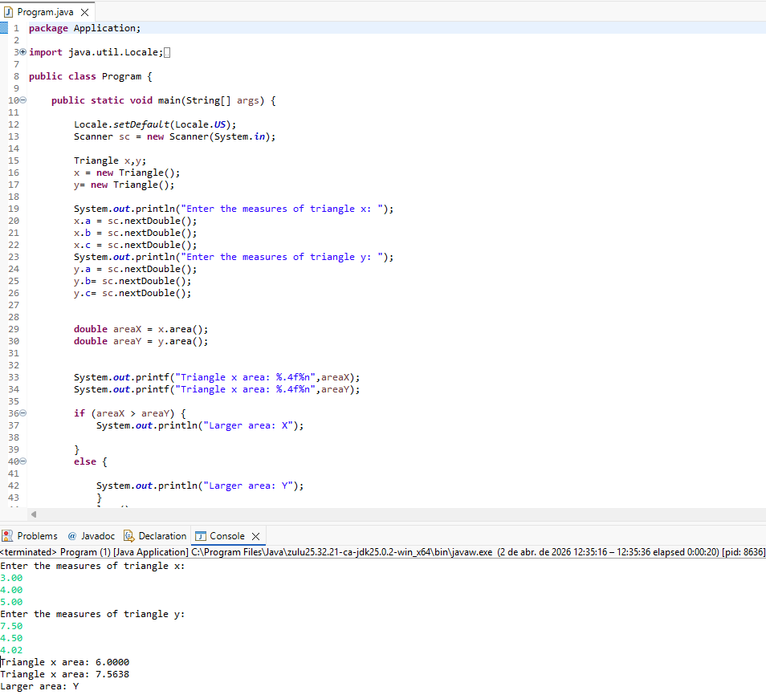

# 📐 Exercício: Cálculo de Área de Triângulos (POO)

Este repositório contém um exercício prático para fixação de conceitos de **Programação Orientada a Objetos (POO)** em Java, comparando a abordagem estrutural com a orientada a objetos.

## 📝 O Problema
Fazer um programa para ler as medidas dos lados de dois triângulos X e Y. Em seguida, mostrar o valor das áreas dos dois triângulos e dizer qual dos dois possui a maior área.

A fórmula para calcular a área de um triângulo a partir das medidas de seus lados $a$, $b$ e $c$ é a fórmula de Heron:

$$p = \frac{a + b + c}{2}$$
$$area = \sqrt{p(p - a)(p - b)(p - c)}$$

---

## 🧠 Anotações de Estudo

### 1. Classe (O Molde)
A **Classe** é a definição do tipo. É como um "molde" ou uma planta baixa. 
* Neste exemplo, a classe `Triangle` define que todo triângulo possui três atributos: `a`, `b` e `c`.

### 2. Objeto (A Instância)
Os **Objetos** são instâncias da classe. São a "realização" do molde com dados específicos.
* Exemplo: Quando fazemos `x = new Triangle();`, a variável `x` recebe uma nova instância, tornando-se um objeto real que ocupa lugar na memória.

## 🚀 Benefícios da Orientação a Objetos observados:
1. **Reaproveitamento de código:** A lógica do cálculo da área (método `area()`) fica dentro da classe `Triangle`, evitando repetição de fórmulas na `Main`.
2. **Organização:** O código fica mais limpo e fácil de dar manutenção.
3. **Encapsulamento:** Os dados e o comportamento que pertencem ao triângulo ficam agrupados em um só lugar.

## 🖥️ Resultado da Execução

