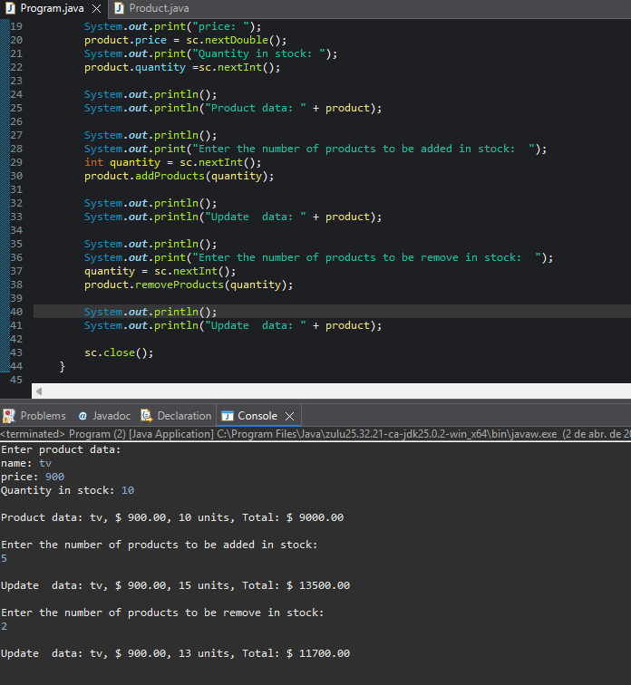

# 📦 Exercício 02: Controle de Estoque (POO)

Este projeto simula um sistema simplificado de inventário para fixar o conceito de **Métodos com Parâmetros** e manipulação de estado de objetos em Java.

## 🎯 O Desafio
Criar uma aplicação que leia os dados de um produto (nome, preço e quantidade). O sistema deve permitir:
1.  Exibir os dados do produto com o valor total em estoque.
2.  Adicionar produtos ao estoque (entrada).
3.  Remover produtos do estoque (saída).
4.  Atualizar e exibir os dados após cada operação.

---

## 💡 Conceitos de POO Aplicados

### 1. Métodos com Alteração de Estado
Diferente de apenas calcular um valor e retornar, aqui os métodos alteram os atributos da própria classe:
* **`addProducts(int quantity)`**: Utiliza `this.quantity += quantity;` para atualizar o estoque atual.
* **`removeProducts(int quantity)`**: Utiliza `this.quantity -= quantity;` para reduzir o estoque.

### 2. Sobrecarga do método `toString()`
Implementamos o `toString()` na classe `Product` para que, ao dar um `System.out.println(product)`, o Java entregue os dados formatados automaticamente, sem precisar concatenar manualmente na classe principal.

---

## 🖥️ Resultado da Execução
Aqui está o sistema funcionando no console (Eclipse):

---

## 🛠️ Estrutura do Código
* **`entities.Product`**: Contém os atributos e a lógica de negócio (cálculos e atualizações).
* **`application.Program`**: Contém a interface com o usuário (Scanner e prints).
